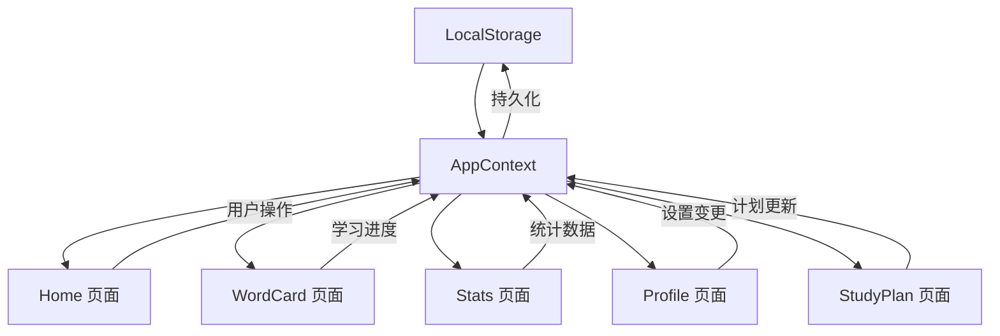

# 语言学习应用 - 交互增强计划

## 概述

本计划旨在为语言学习应用添加完整的前端交互功能，无需后端 API，使用 React 状态管理和 LocalStorage 实现数据持久化。

---

## 架构设计

### 状态管理方案

```
src/
├── store/
│   ├── AppContext.tsx       # 全局状态上下文
│   ├── useAppStore.ts       # 自定义 Hook
│   └── types.ts             # 类型定义
├── data/
│   └── mockWords.ts         # 模拟词库数据
└── utils/
    └── storage.ts           # LocalStorage 工具函数
```

### 数据流架构



---

## 各页面交互增强详情

### 1. 首页 Home.tsx

| 功能 | 当前状态 | 增强方案 |
|------|----------|----------|
| 今日目标进度环 | 静态显示 | 动态计算，点击跳转学习 |
| 新词/复习卡片 | 无交互 | 点击跳转到对应学习模式 |
| 连续打卡 | 静态显示 | 根据学习记录动态计算 |
| 开始学习按钮 | 已有跳转 | 保持现有功能 |
| 日期显示 | 硬编码 | 动态获取当前日期 |

**新增交互：**
- 进度环点击 → 跳转到 `/learn`
- 新词卡片点击 → 跳转到 `/learn?mode=new`
- 复习卡片点击 → 跳转到 `/learn?mode=review`

---

### 2. 单词卡片 WordCard.tsx

| 功能 | 当前状态 | 增强方案 |
|------|----------|----------|
| 单词内容 | 硬编码单词 | 从词库动态获取 |
| 进度显示 | 静态 24/36 | 动态计算当前进度 |
| 发音按钮 | 无功能 | 使用 Web Speech API 播放发音 |
| 忘记/不确定/认识 | 无功能 | 记录学习结果，切换下一词 |
| 关闭按钮 | 已有功能 | 保持现有功能 |

**新增交互：**
- 发音按钮 → TTS 朗读单词
- 忘记 → 标记为需复习，显示下一个单词
- 不确定 → 标记为学习中，显示下一个单词
- 认识 → 标记为已掌握，显示下一个单词
- 学习完成 → 显示完成弹窗，可返回首页

**单词切换动画：**
- 卡片翻转效果显示释义
- 滑动切换下一个单词

---

### 3. 学习计划 StudyPlan.tsx

| 功能 | 当前状态 | 增强方案 |
|------|----------|----------|
| 每日新词滑块 | 已有交互 | 同步到全局状态 |
| 复习强度滑块 | 已有交互 | 同步到全局状态 |
| 保存按钮 | 无功能 | 保存设置到 LocalStorage |
| 更换词书按钮 | 无功能 | 显示词书选择弹窗 |
| 更新计划按钮 | 无功能 | 保存并返回上一页 |
| 预计完成时间 | 静态 | 根据设置动态计算 |

**新增交互：**
- 保存按钮 → Toast 提示保存成功
- 更换词书 → 弹窗选择不同词书
- 更新计划 → 保存设置 + 返回 + Toast 提示

---

### 4. 数据统计 Stats.tsx

| 功能 | 当前状态 | 增强方案 |
|------|----------|----------|
| 时间维度切换 | 无交互 | 切换显示不同时间段数据 |
| 掌握情况进度 | 静态 | 从学习记录动态计算 |
| 记忆曲线图表 | 静态 | 根据学习数据动态渲染 |
| 最近学习列表 | 静态 | 显示实际学习过的单词 |
| 查看全部按钮 | 无功能 | 跳转到完整单词列表 |

**新增交互：**
- 本周/本月/季度/全部 Tab → 切换统计数据
- 单词卡片点击 → 跳转到该单词详情
- 日历按钮 → 显示学习日历弹窗

---

### 5. 个人中心 Profile.tsx

| 功能 | 当前状态 | 增强方案 |
|------|----------|----------|
| 学习提醒开关 | 无交互 | 切换通知设置状态 |
| 离线词库 | 无交互 | 显示离线词库管理弹窗 |
| 账户设置 | 无交互 | 显示设置详情页或弹窗 |
| 帮助与支持 | 无交互 | 显示帮助信息弹窗 |
| 分享进度 | 无功能 | 显示分享弹窗或复制链接 |
| 退出登录 | 无功能 | 显示确认弹窗 |
| 查看全部成就 | 无功能 | 显示成就列表弹窗 |

**新增交互：**
- 开关控件 → 实际切换状态
- 设置项 → 弹窗或 Toast 提示
- 分享按钮 → 复制分享链接 + Toast
- 退出登录 → 确认弹窗 + 重置数据

---

## 模拟数据设计

### 词库数据结构

```typescript
interface Word {
  id: string;
  word: string;
  phonetic: string;
  meaning: string;
  example: string;
  exampleTranslation: string;
  partOfSpeech: string;
  category: string;
}

interface LearningRecord {
  wordId: string;
  status: 'new' | 'learning' | 'mastered';
  lastReviewAt: Date;
  nextReviewAt: Date;
  correctCount: number;
  incorrectCount: number;
}
```

### 模拟词库内容

准备 30-50 个常用英语单词，包含：
- 单词、音标、释义
- 例句及翻译
- 词性、分类标签

---

## 实现优先级

### P0 - 核心功能（必须实现）

1. **全局状态管理** - AppContext + useAppStore
2. **WordCard 学习流程** - 单词切换、状态记录
3. **Home 数据联动** - 进度环、统计数据动态显示

### P1 - 重要功能

4. **StudyPlan 设置保存** - 持久化学习计划
5. **Stats 数据展示** - 动态统计数据
6. **LocalStorage 持久化** - 数据保存到本地

### P2 - 增强功能

7. **Profile 设置交互** - 开关、弹窗
8. **TTS 发音功能** - Web Speech API
9. **动画效果** - 卡片翻转、滑动切换

---

## 技术实现要点

### 1. 状态管理

```typescript
// AppContext.tsx 核心结构
interface AppState {
  // 用户设置
  dailyTarget: number;
  reviewIntensity: number;
  currentBookId: string;
  
  // 学习数据
  learnedWords: LearningRecord[];
  todayLearned: number;
  streak: number;
  
  // 方法
  markWord: (wordId: string, status: string) => void;
  updateSettings: (settings: Partial<AppState>) => void;
  getNextWord: () => Word | null;
}
```

### 2. LocalStorage 持久化

- 自动保存状态变更
- 应用启动时恢复数据
- 提供清除数据功能

### 3. TTS 发音

```typescript
const speak = (text: string) => {
  const utterance = new SpeechSynthesisUtterance(text);
  utterance.lang = 'en-US';
  speechSynthesis.speak(utterance);
};
```

---

## 文件变更清单

| 文件 | 操作 | 说明 |
|------|------|------|
| `src/store/AppContext.tsx` | 新建 | 全局状态上下文 |
| `src/store/types.ts` | 新建 | 类型定义 |
| `src/data/mockWords.ts` | 新建 | 模拟词库 |
| `src/utils/storage.ts` | 新建 | 存储工具 |
| `src/pages/Home.tsx` | 修改 | 添加交互 |
| `src/pages/WordCard.tsx` | 修改 | 完整学习流程 |
| `src/pages/StudyPlan.tsx` | 修改 | 保存功能 |
| `src/pages/Stats.tsx` | 修改 | 动态数据 |
| `src/pages/Profile.tsx` | 修改 | 设置交互 |
| `src/main.tsx` | 修改 | 包裹 Provider |

---

## 预期效果

完成后，用户可以：

1. ✅ 在首页看到动态更新的学习进度
2. ✅ 进入学习页面进行单词学习
3. ✅ 点击发音按钮听单词朗读
4. ✅ 标记单词掌握程度并自动切换
5. ✅ 保存学习计划设置
6. ✅ 查看动态更新的统计数据
7. ✅ 操作个人中心的各项设置
8. ✅ 数据持久化，刷新不丢失
